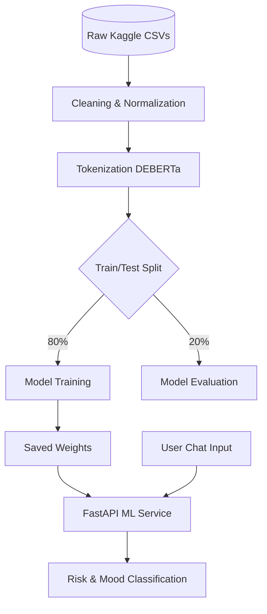

# Lumina Mind

A warm, reflective wellness app with text and voice chat. Uses AI-powered mental health classification and generates personalized feedback reports.

## Features

- **Authentication** — Sign up and log in. Feedback reports are unique per user.
- **Text Chat** — Converse with an empathetic OpenAI assistant at your own pace.
- **Voice Chat** — Live voice conversations via VAPI. HIPAA-compliant; calls are never recorded.
- **AI Feedback Reports** — Finish a session after 5+ messages to get a summarized report and classification from our feedback assistant.
- **ML Classification** — Two-stage pipeline: mood (Anxiety, Depression, Normal, Stress) and risk (Suicidal).
- **Privacy Policy** — Clear explanation of how we protect user data.
- **Get Help** — Crisis resources (911, 988) and medical disclaimer.

## Tech Stack

| Layer | Tech |
|-------|------|
| Frontend | React, TypeScript, Vite, React Router, Tailwind CSS |
| Backend | Node.js, Express |
| Auth | JWT, bcrypt |
| ML | Python, FastAPI, PyTorch, DeBERTa (mood + risk models) |
| Analytics | Pandas, scikit-learn, DuckDB, Streamlit, SHAP, Pytest |
| APIs | OpenAI Assistants, VAPI |

## Setup

### 1. Install dependencies

```bash
npm install
cd backend && npm install
cd frontend && npm install
cd ../ml && pip install -r requirements.txt
```

### 2. Environment variables

**Never commit `.env` files.** Copy the example files and add your keys:

```bash
cp backend/.env.example backend/.env
cp frontend/.env.example frontend/.env
```

**Backend** (`backend/.env`):

| Variable | Description |
|----------|-------------|
| `PORT` | Server port (default: 3001) |
| `OPENAI_API_KEY` | OpenAI API key |
| `OPENAI_ASSISTANT_ID` | Chat assistant ID |
| `FEEDBACK_ASSISTANT_ID` | Feedback/summary assistant ID |
| `VAPI_PUBLIC_KEY` | VAPI public key |
| `VAPI_ASSISTANT_ID` | VAPI voice assistant ID |
| `ML_SERVICE_URL` | ML service URL (default: http://localhost:8000) |
| `JWT_SECRET` | **Required.** Secret for JWT signing (use a strong random string) |

**Frontend** (`frontend/.env`):

| Variable | Description |
|----------|-------------|
| `VITE_VAPI_PUBLIC_KEY` | Same as backend VAPI_PUBLIC_KEY |
| `VITE_VAPI_ASSISTANT_ID` | Same as backend VAPI_ASSISTANT_ID |

### 3. Run

```bash
npm run dev
```

Starts all three services: ML (port 8000), backend (3001), frontend (5173).

## ML Models & Data Pipeline

Two-stage classification pipeline:

1. **Mood model** (`models/mood4_model`) — 4 labels: Anxiety, Depression, Normal, Stress
2. **Risk model** (`models/risk_model`) — 2 labels: NotSuicidal, Suicidal

Combined output: primary label (Suicidal if risk ≥ 0.5, else top mood) plus scores for all categories.

**Note:** Model files (~1.4GB) are excluded from the repo (GitHub 100MB limit). Place your trained models in `models/mood4_model/` and `models/risk_model/` to run the ML service.

### Data Pipeline


*See [DATA.md](DATA.md) for full pipeline details.*

## Analytics & Evaluation

We have built a comprehensive analytics suite for LuminaMind, covering everything from EDA to explainability.

- **[Data Pipeline Docs](DATA.md)**: Full details on preprocessing, tokenization, and splits.
- **[Streamlit Dashboard](dashboard/streamlit_app.py)**: Interactive UI for dataset stats, model performance, and SHAP token highlights. Run with `streamlit run dashboard/streamlit_app.py`.
- **[EDA Notebooks](notebooks/)**: In-depth analysis of Sentiment140 and Suicide Watch datasets.
- **[Model Evaluation](notebooks/outputs/evaluation/)**: Precision-recall curves, calibration curves, and confusion matrices.
- **[SHAP Explainability](notebooks/outputs/shap/shap_attributions.html)**: Interactive HTML showing token-level attributions.
- **[SQL Analytics](analytics/query_results.md)**: DuckDB-powered session event analysis.
- **[A/B Comparison](experiments/deberta_vs_baseline.md)**: DeBERTa vs. TF-IDF Logistic Regression experiment report.
- **[Test Suite](tests/)**: Pytest suite covering all analytics code.

## Project Structure

```
LuminaHealth/
├── backend/           # Express API
│   └── src/
│       ├── lib/       # auth, transcriptProcessor, userStore, feedbackReportStore
│       └── routes/    # auth, chat, transcripts, conversations, feedback
├── frontend/          # React + Vite
│   └── src/
│       ├── contexts/  # AuthContext
│       ├── pages/     # Home, Login, Signup, TextChat, VoiceChat, Reports, Feedback, Privacy, GetHelp
│       └── components/
├── ml/                # Python FastAPI ML service
│   └── main.py       # Two-stage predict endpoint
├── models/
│   ├── mood4_model/  # DeBERTa mood classifier
│   └── risk_model/   # DeBERTa risk classifier
└── README.md
```

## API Overview

| Endpoint | Auth | Description |
|----------|------|-------------|
| `POST /api/auth/signup` | No | Create account |
| `POST /api/auth/login` | No | Log in, get JWT |
| `POST /api/chat/message` | No | Text chat message |
| `POST /api/transcripts` | No | Voice transcript (stores per session) |
| `GET /api/conversations/:id/overall` | No | Overall ML analysis for conversation |
| `POST /api/feedback/finish-session` | Yes | Generate feedback report from transcript + ML output |
| `GET /api/feedback/reports` | Yes | List user's feedback reports |
| `GET /api/feedback/reports/:id` | Yes | Get single report |

## Data Storage

- **Users**: `backend/data/users.json` (hashed passwords)
- **Feedback reports**: `backend/data/feedback-reports.json` (no transcripts stored)
- **Transcripts**: In-memory only during session; never persisted in reports
- **Auth**: Session-only (sessionStorage). Clears when browser tab closes.